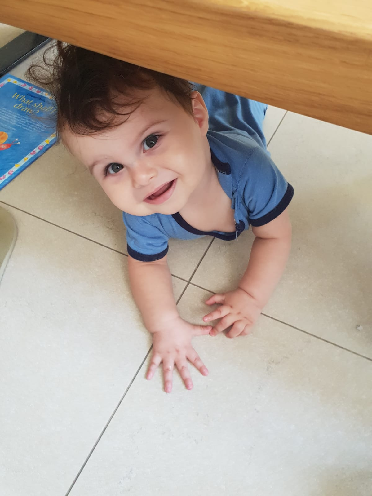
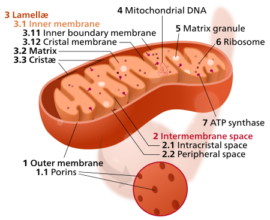

# Table of Contents    
1. [Our story](#Our_story)  
2. [Few words about GFER syndrome](#Few_words_about_GFER_syndrome)   
2.1. [What is GFER](#What_is_GFER)   
2.2. [What is GFER Syndrome](#What_is_GFER_Syndrome)   
  
# Our story   
<a name="Our_story"/>  

  
  
This cute baby name is Alon and he is 9 months old in the picture which was taken in August 2018. When Alon was 3 months old congenital cataracts were suddenly forming in his eyes and urgent surgeries were required. Along with the surgeries metabolic and genetics tests (Exome) where performed. Alone's diagnostic had shown a high level of lactate and elevated liver enzymes along with few other anomalies but no clear explanation for the cataract's cause. 
  
It was only two months later that the Exome results had arrived with devastating news.  
Alone has a mutation in a gene called GFER. It is a single nucleotide (a letter in the DNA) change in each of his gene's copies. One is a stop codon (c.502C>T; p.Gln168*), while the other (c.421C>T; p.Pro141Ser) drastically changes the resulted protein structure.  
The disease has only 9 documented cases. All of the documented children suffer from a loss of mental abilities (neurodegenerative), severe muscle weakness (myopathy) and many other horrible symptoms. What is more, the disease is a progressive mitochondrial disease (meaning their state deteriorates over time) and a healthy child now is not an indication what his state will be in the next year, month, week or day. As it is an ultra-rare disease, there is no money or interest in it and no one had even tried to develop a treatment for it.

I was sitting there, in that meeting, hearing the news with a single mantra looping in my mind: "Hear, Learn, Act". As we came back home, my wife and I, swore an oath:  
**This will not be his future!**   

Since then, both of us left our jobs and set on a long track dedicating our time and efforts to this cause.
 
I do hope to report good news from time to time. In the meanwhile, we are on a very lonely path and if you find this page relevant (due to walking on this path or from research perspective) drop me please a word at maydanw@gmail.com and let's disscuss about what can be done.
  
# Few words about GFER syndrome  
<a name="Few_words_about_GFER_syndrome"/>  
  
## What is GFER 
<a name="What_is_GFER"/>  

> Protein: FAD-linked sulfhydryl oxidase ALR  
> Gene: GFER
>  
>**Isoform 1:**
 FAD-dependent sulfhydryl oxidase that regenerates the redox-active disulfide bonds in CHCHD4/MIA40, a chaperone 
essential for disulfide bond formation and protein folding in the mitochondrial intermembrane space. The reduced form 
of CHCHD4/MIA40 forms a transient intermolecular disulfide bridge with GFER/ERV1, resulting in regeneration of the 
essential disulfide bonds in CHCHD4/MIA40, while GFER/ERV1 becomes re-oxidized by donating electrons to cytochrome c or 
molecular oxygen   
**Isoform 2:**  
May act as an autocrine hepatotrophic growth factor promoting liver regeneration.  
[GFER functions taken from uniprot](https://www.uniprot.org/uniprot/P55789)
  
## What is GFER Syndrome  
<a name="What_is_GFER_Syndrome"/>  

To understand what is GFER syndrome first we need to talk about the mitochondria - the powerhouse of the cell.

This little creature in the image is mitochondrion and in each cell in our body we have a community of these. 
I wrote creature as it was once, long ago, an independent creature. 
Nowadays they are no longer independent and tightly coupled to our own genome. 
How much? About 13 genes are encoded in the mitochondria and ~1,000 genes which are critical to its 
existence are in our own nucleus. 
  
GFER also called ALR (or ERV1 in yeast) is a gene which is encoded by the cell nucleus and its protein product 
is imported into the Mitochondria inner membrane space (IMS). Here, GFER together with its partner, CHCHD4 
(called Mia40 in yeast) are in charged of folding relevant mitochondrial proteins into their functional forms. 
More formally GFER oxidizes CHCHD4 and transfer the electron into Cytochrome C and to the electron transport chain(ETC).
If there is a problem in GFER then CHCHD4 remain reduced and cannot fold the mitochondria proteins and sub-units. 
In the cellular level, this will cause:

1. ETC efficiency will decrease due to the missing electrons.
1. The mitochondria will lack various building blocks and its ability to maintain itself will be hindered.
1. The IMS will become bloated with partially folded proteins with structural damage. This damage may cause 
cytochrome c depletion and lead to apoptosis.
1. Mitochondrial unfolded protein response will be constantly active.
1. Mia40 may free it's electrons, eventually, as free radical which hinders the mitochondria, 
including its DNA, until it cannot repair itself.

As ATP production will hinder, the cell energy production process will produce lots of oxidative stress.
  
To make things more complicated GFER have other roles like blocking (inhibiting) the signal which causes fission 
of mitochondria (DRP1) and growth factor signaling for liver regeneration.
  
From the clinical perspective, it means a progressive neurodegenerative disease with myopia, congenital cataracts, loss of motor abilities and more.
  
This is the disease we are in a war with and we want to stop from taking its toll.
 
 References:
 
 Di Fonzo A, Ronchi D, Lodi T, Fassone E, Tigano M, Lamperti C, et al. (May 2009). "The mitochondrial disulfide relay system protein GFER is mutated in autosomal-recessive myopathy with cataract and combined respiratory-chain deficiency". American Journal of Human Genetics. 84 (5): 594–604. doi:10.1016/j.ajhg.2009.04.004. PMC 2681006. PMID 19409522.
 
 Nambot S, Gavrilov D, Thevenon J, Bruel AL, Bainbridge M, Rio M, et al. (August 2017). "Further delineation of a rare recessive encephalomyopathy linked to mutations in GFER thanks to data sharing of whole exome sequencing data". Clinical Genetics. 92 (2): 188–198. doi:10.1111/cge.12985. PMID 28155230.
 
 Todd LR, Damin MN, Gomathinayagam R, Horn SR, Means AR, Sankar U (April 2010). "Growth factor erv1-like modulates Drp1 to preserve mitochondrial dynamics and function in mouse embryonic stem cells". Molecular Biology of the Cell. 21 (7): 1225–36. doi:10.1091/mbc.E09-11-0937. PMC 2847526. PMID 20147447.
 
